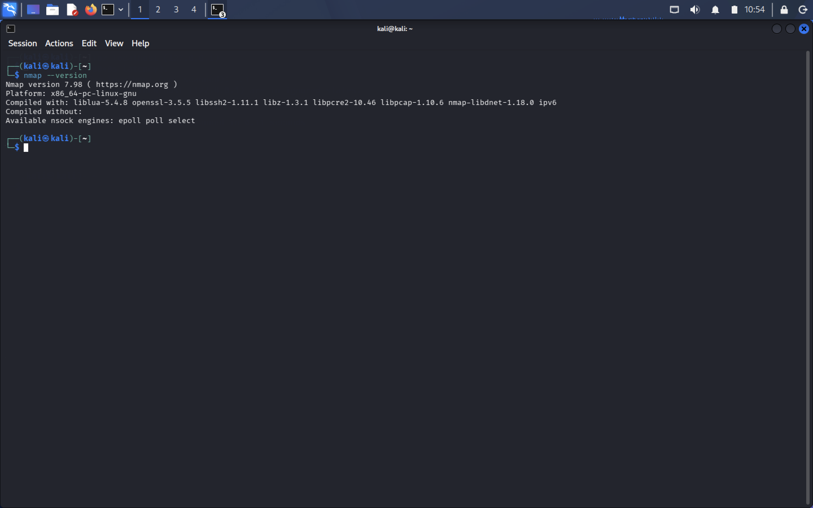
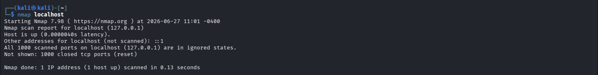
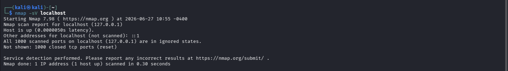
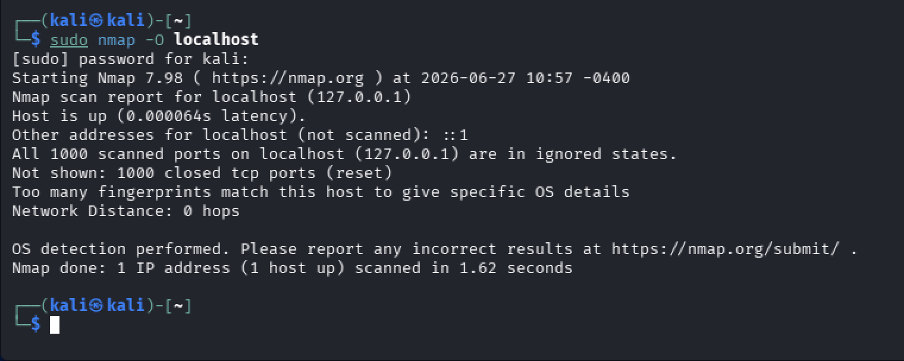

# Ethical Hacking Task 02 – Network Scanning & Service Enumeration

# Objective

The objective of this task is to understand the **Scanning and Enumeration** phase of Ethical Hacking using **Nmap**. During this task, various Nmap scanning techniques are used to identify active hosts, discover open ports, enumerate running services, detect service versions, identify the operating system, and analyze the security implications of exposed services. This exercise provides practical experience with one of the most important phases of penetration testing while working only on authorized systems.

---


# Tools Used

- Nmap (Network Mapper)
- Terminal / Command Prompt
- Localhost (127.0.0.1)
- Operating System (Linux/Windows)

---

# Part A – Verify Nmap Installation

# Objective

Before performing any network scan, it is important to verify that Nmap is correctly installed on the system.

# Command

```bash
nmap --version
```

# Description

The above command displays the installed version of Nmap along with additional information such as the supported libraries and compilation details. Successful execution confirms that Nmap is ready for use.



```

---

# Part B – Scan Localhost

 Objective

Perform a basic scan on the local machine to identify active hosts and open ports.

# Command

```bash
nmap localhost
```

or

```bash
nmap 127.0.0.1
```

# Description

This command performs a default TCP scan on localhost. It identifies:

- Host availability
- Open ports
- Running network services

The output provides basic information about the services currently accepting connections.

# Expected Observation

- Host is up
- Open TCP ports are displayed
- Service names are identified



```

---

# Part C – Service Version Detection

# Objective

Identify the version of services running on each open port.

# Command

```bash
nmap -sV localhost
```

# Description

The **-sV** option enables service version detection. Instead of displaying only the service name, Nmap attempts to determine the exact software and version running on each port.

# Example Output

| Port | Service | Version |
|------|----------|----------|
|22|SSH|OpenSSH|
|80|HTTP|Apache HTTP Server|

# Importance

Knowing service versions helps security professionals determine whether outdated or vulnerable software is running on the target system.



```

---

# Part D – Operating System Detection

# Objective

Determine the operating system running on the target machine.

# Command

```bash
sudo nmap -O localhost
```

# Description

The **-O** option performs OS fingerprinting by analyzing responses from the target host. Nmap compares these responses with its fingerprint database to predict the operating system.

# Observation

Operating System Detected:

```
(Add your detected OS)
```

# Importance

Operating System detection helps identify possible vulnerabilities associated with a specific OS version. This information is valuable during vulnerability assessment and penetration testing.



```

---

# Part E – Research on Common Ports

The following table summarizes commonly used network ports and their associated services.

| Port | Protocol | Purpose | Security Risk |
|------|----------|----------|---------------|
|20/21|FTP|File Transfer|Weak authentication|
|22|SSH|Secure Remote Login|Brute-force attacks|
|23|Telnet|Remote Login|Data transmitted in plain text|
|25|SMTP|Email Transfer|Spam abuse|
|53|DNS|Domain Name Resolution|DNS Spoofing|
|80|HTTP|Web Server|Unencrypted communication|
|110|POP3|Email Retrieval|Credential theft|
|143|IMAP|Email Access|Misconfiguration|
|443|HTTPS|Secure Web Traffic|SSL/TLS vulnerabilities|
|445|SMB|Windows File Sharing|Malware propagation|
|3389|RDP|Remote Desktop|Brute-force attacks|

---

# Part F – Scan Analysis

# Analysis

After performing all scans, the following observations were made:

- The localhost responded successfully to scan requests.
- Multiple ports may be open depending on the services installed on the system.
- Service version detection provides detailed information about running applications.
- OS detection successfully identifies the probable operating system.
- Every unnecessary open port increases the attack surface.
- Services such as FTP or Telnet should be disabled if they are not required.
- Firewalls should be configured properly to restrict unauthorized access.

---

# Part G – Final Scan Report

# Scan Information

| Item | Details |
|------|----------|
|Target|Localhost (127.0.0.1)|
|Tool Used|Nmap|
|Scan Date|Add Date|
|Performed By|Your Name|

---

# Commands Executed

```bash
nmap --version

nmap localhost

nmap -sV localhost

sudo nmap -O localhost
```

---


- Nmap successfully detected active services running on localhost.
- Service version detection revealed detailed software information.
- OS detection identified the operating system accurately.
- Open ports indicate available network services that could become attack vectors if left unsecured.
- Regular scanning helps identify unnecessary services and improve system security.

---


